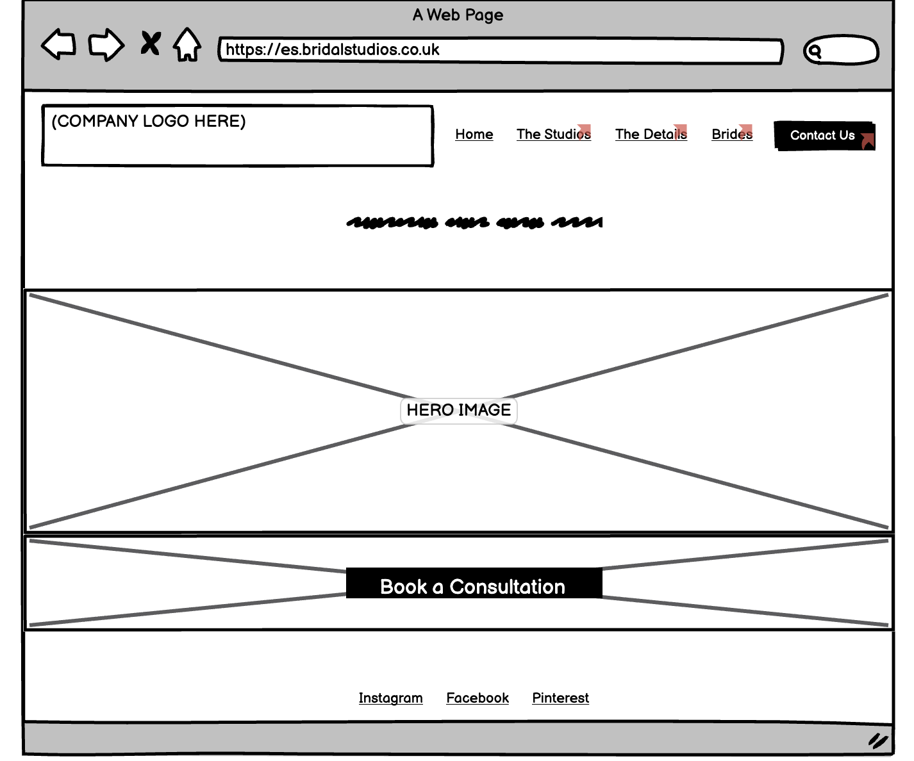
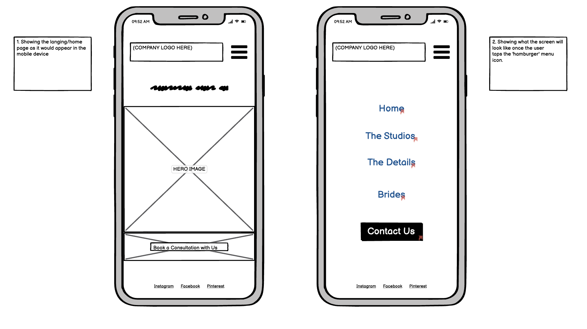
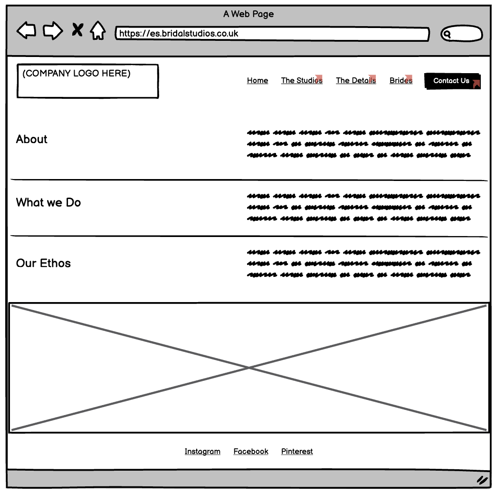
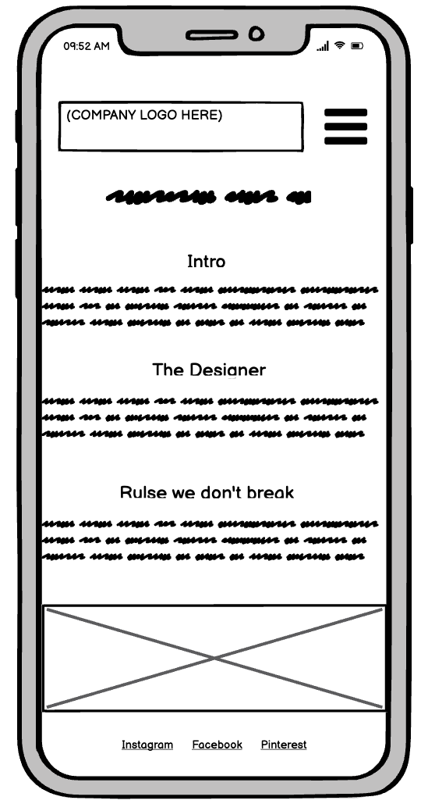
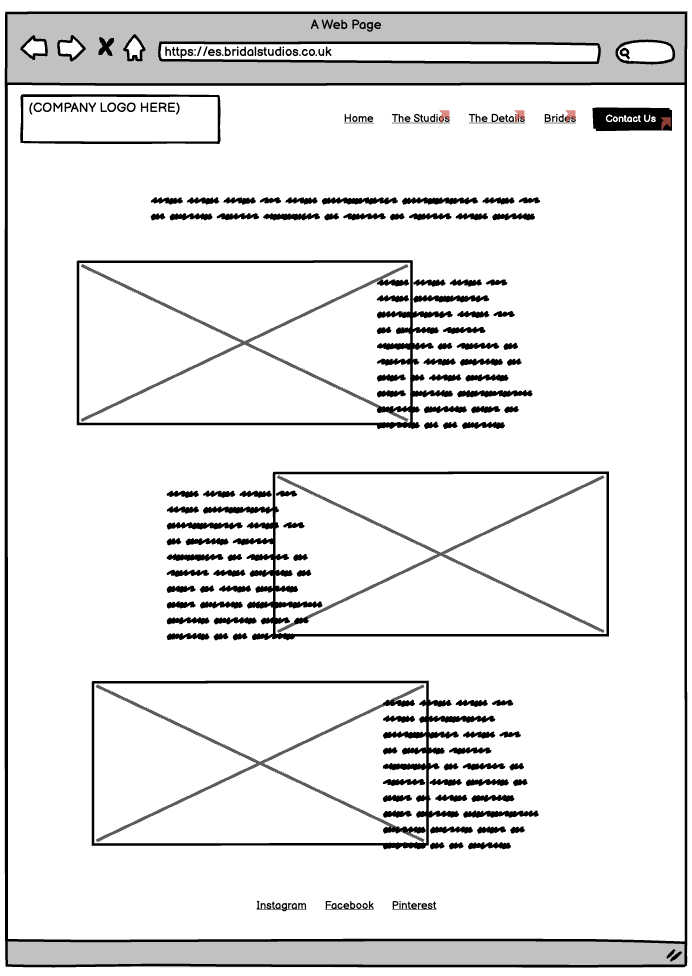
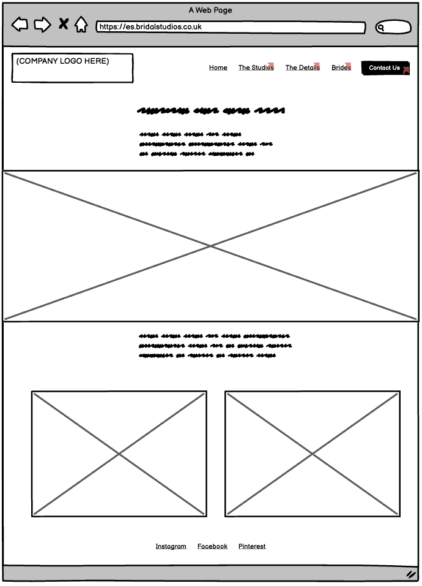
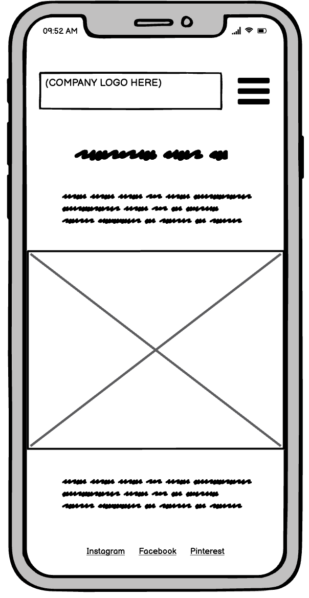
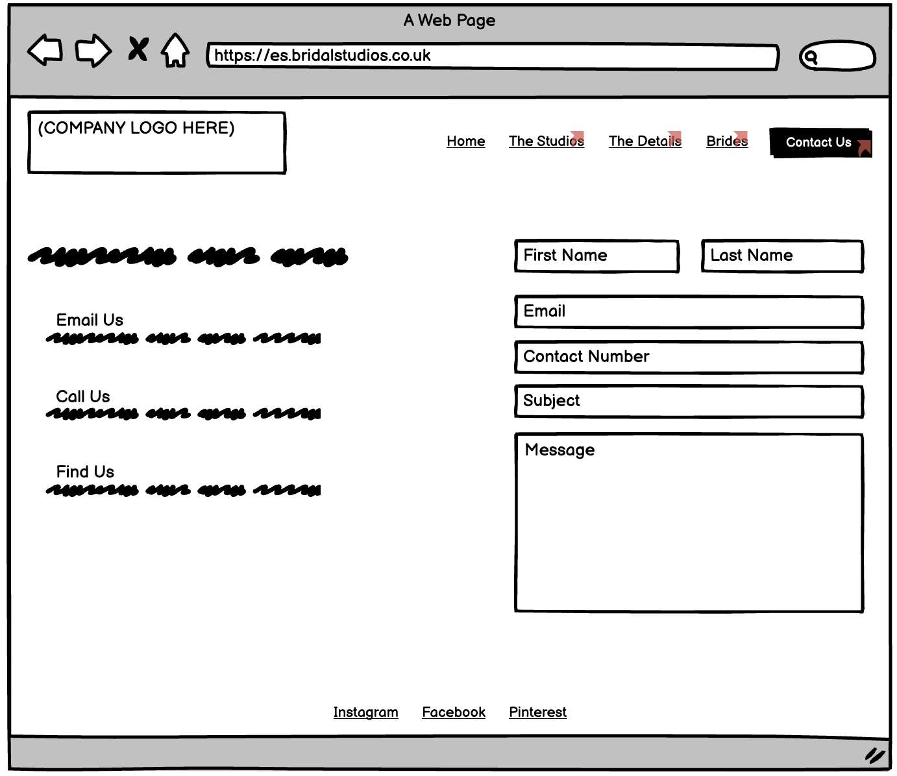
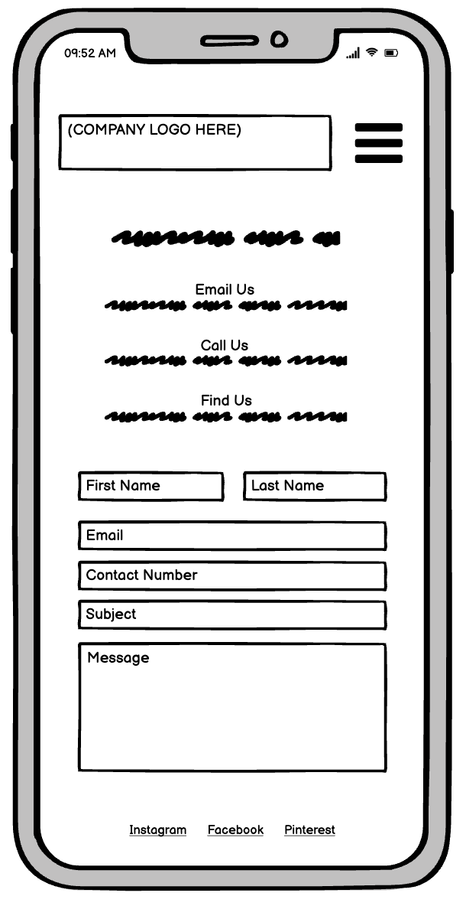

# ES Bridal Studios 

Description here 

# Features

### Wireframes for both desktop and mobile devices;

### Home/Landing page 

The main features is a large hero image for impact and a CTA button to directly inivte the user to 'book a consulation'. 

Desktop: Wireframe layout for Home page.

Mobile: Wireframe layout for Home page. The first screen shows what the site will look like when it appears on a mobile device for the 1st time. The second screen shows what the site will look like once the use clicks on the 'hamburger' menu icon.

### 'The Studios' page 

This page is the 'about' page outlining key company information such as intro, company ethos, etc

Desktop: Wireframe layout for 'The Studios' page. The main focus for this page is to inform the user who the company is so the main feature on this page will be the copy along with a complimentary image. 

Mobile: Wireframe layout for 'The Studios' page.

### 'The Details' page 

This page explains the service the company offers. The main feautre here will be the copy togehter with complimentary images. 

Desktop: Wireframe layout for 'The Details' page.

Mobile: Wireframe layout for 'The Details' page. The user will have to scroll up and down the screen to see/read more information.  Do not want to include a scroll bar for aestheic reason (want to keep the page 'clean')

### 'Brides' page 

This page will include stories of 'real' brides who the company has designed wedding dresses for. This page will document part of the design process as well as images of the bride on her actual wedding day. Complimentary features will include testimonials and images. 

Desktop: Wireframe layout for 'Brides' page.

Mobile: Wireframe layout for 'Brides' page.

### 'Contact' page 

Contact page where the user will be prompted to contact the company directly, or fill out a form to book a consulation. 

Desktop: Wireframe layout for 'Contact' page.

Mobile: Wireframe layout for 'Contact' page.

# Testing 

# Deployment 

# Credits 
