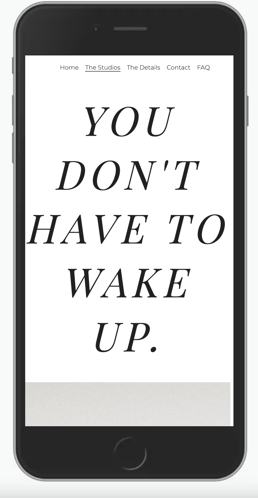
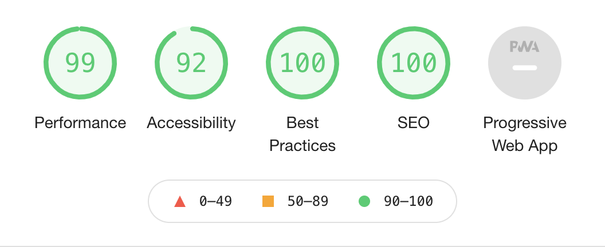

# ES Bridal Studios 

## Welcome to E.S Bridal Studios. The website for the modern Bride and Designer. 

This project came about last year when my best friend was hunting for the perfect dress for her big day. She was looking for a bespoke gown, however the hunt for this service was very demotivating; the majority of the websites she came across seemed out-dated in style, provided lengthily information and visual unappealing. My friend was left feeling unmotivated and ended up looking else where for this service. So E.S Bridal studios was born. 

This website is made for both the bride who has no limits and for the designer that can adhere to those demands. A website that captures the spirit of femininity whilst breaking free from tradition. The aim of the website is to inform, encourage the user to book a consultation and as well as promote the business of the designer.

# USERS

This website was made with two users in mind; 1. A wedding dress designer and 2. A future bride. Both with a shared end goal of getting a bespoke dress. The purpose of the website is to expand the designer’s business online, whilst encouraging the end user to book a consultation. Here are a few user scenarios;

## User 1; Wedding Dress Designer

This user has a bridal business who either has an existing website and wants to update/revamp their site to something modern, more user friendly, visually impactful as well as improve their SEO’s. Or, doesn’t have a website and wants to use this website as a template to launch their business online. The aim for both scenarios is to further promote their services online, invite potential clients to book a consultation via the website and ultimately, get a new paying client. 

## User 2; Bride-to-Be

This user is looking for a designer/brand/company who offers a bespoke wedding dress service and wants to book a consultation. The purpose of the website for this user is; to inform them on what the bespoke service entails, provide an indication on price, introduce the designer, outline company ethos and allow them to book a consultation via the from provided.

# Features

Pages on the site are;

## Home
- Provides an introduction to the designer and bespoke service. 

- Main features on this page include; links to other pages on the website enabling the user to easily explore other pages on the site, a testimonial section to show what previous brides have said about the designer, a call-to-action section at the bottom of the page which encourages the user to book a consultation. 

- As this is the landing page, this page was built to provide visual impact with the use of beautiful imagery, larger fonts and links to entice the user to stay on this website. 

## The Studios 
- This page shows the reader who the Designer is and who will be making their dress. An image of the designer is included to make the designer seem like a friend and not a stranger to the user.

- This page also provides important information on company values which is the ‘Rules we don’t Break’ section.

## The Details 
- This page outlines the different stages of the designer’s bespoke service, it gives details on what to expect and indication on price and times so the user is aware of what the service consist of. 

- Features on this page include; Link to the ‘Contact’ page where the user is directed to the ‘Contact’ page and can go ahead and book a consultation, or if they have more questions, they can click on the ‘FAQ’  link and the user will be taken to the FAQ where they will see a list of frequently asked questions.

## Contact Us  
- This page encourages the users to get in touch either by emailing the designer via the email provided, or book a consultation using the from provided.

- The booking form is valuable to the user as it gives them the ability to select their preferred date and time for a consultation. 

- The form also prompts the user to input a message before submitting the form, this is the chance for the user to tell the designer what thoughts or questions they may have prior to the consultation. 

## FAQs
- This page outlines all the FAQs a user may have about getting a bespoke dress and should provide more clarity to the user. If they have any more questions, they can navigate to the ‘Contact’ page via the menu bar where they can contact the designer for any unanswered questions. 

## Existing features include;

## Nav menu;
Featured at the top of every page, the nav menu allows the user to easily move around the site 

### 'Book A Consultation’ button; 
This button appears on the home page and takes the user directly to the contact page where they can make either make a booking by filling out the form provided, or contacting the designer via the email displayed. 

### Link to ‘The Studios’ page 
This features appears on the home page and takes the user to the Studios page where they can find out about the designer, the bridal studios and company ethos.

### Booking form;
This is on the contact page and allows the user to book a consultation with the designer 

### The FAQ’s;
The page provides further information to the end user/potential clients and answers a few questions they may already have 

# TECHNOLOGIES USED

- HTML

- CSS

# TESTING

- I tested this page works on the following browsers: Chrome and Safri.

- I confirmed this project is responsive, looks good and functions on standard mobile and laptop screen sizes using the devtool device toolbar. 

- I confirmed that the navigation menu and all pages are easy to read and understand.

- I have confirmed that the form works; requires entries in every file, will only accept an email in the email file and the submit buttons works. 

# BUGS

No bugs were encountered (luckily!)

# VALIDATOR TESTING

- HTML; No errors were returned when passing the code through the official W3C validator.

- CSS: No errors were found when passing through the official (Jigsaw) validator.

- Accessibility; I confirmed that the colours and fonts selected are easy to read and accessibly by running it through the lighthouse in devtools.

# DEPLOYMENT

The website was deployed to GitHub Pages. 

# CREDITS 

## CONTENT;
- The code for this project is original 

- All copy in this project is original  

## MEDIA;

The photos used in this site were obtained from;

- www.pexels.com

- www.unsplash.com

- My Iphone :) 