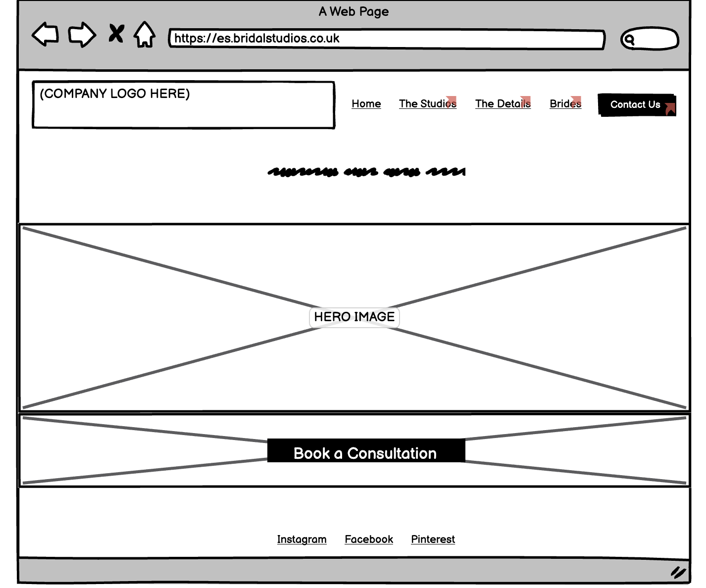
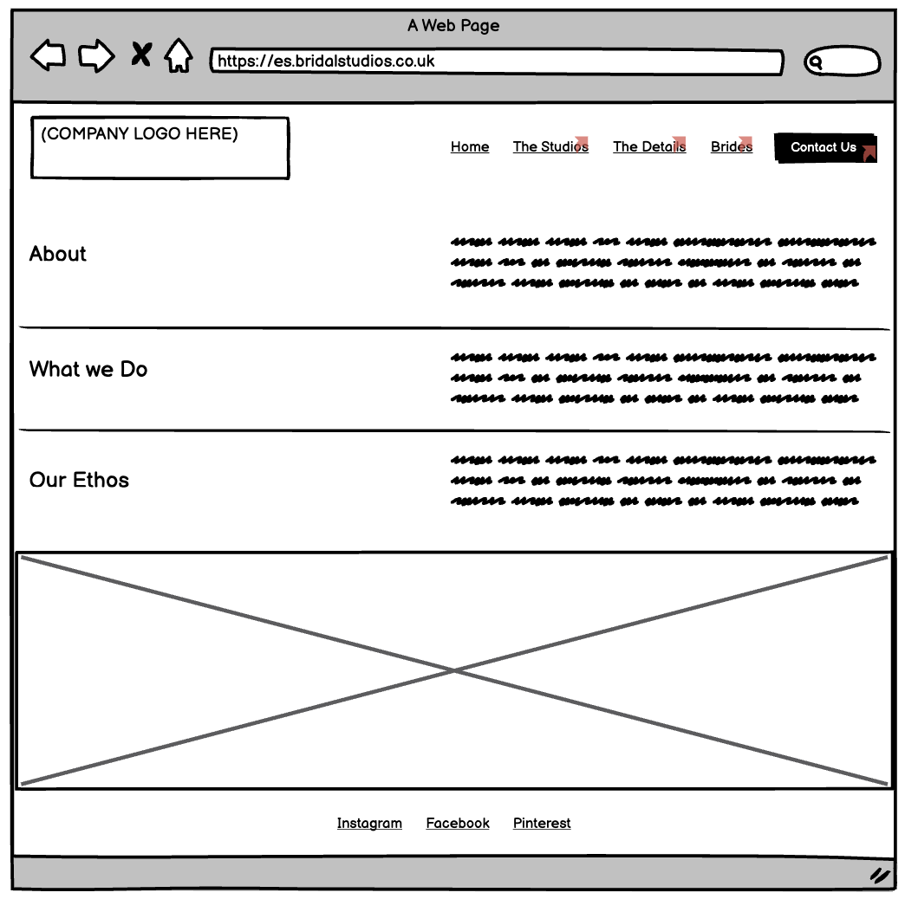
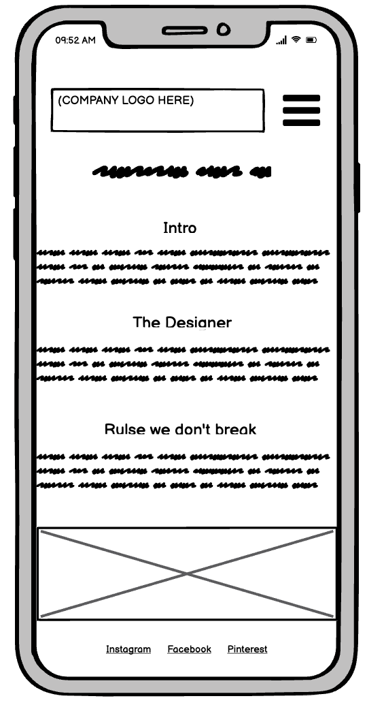
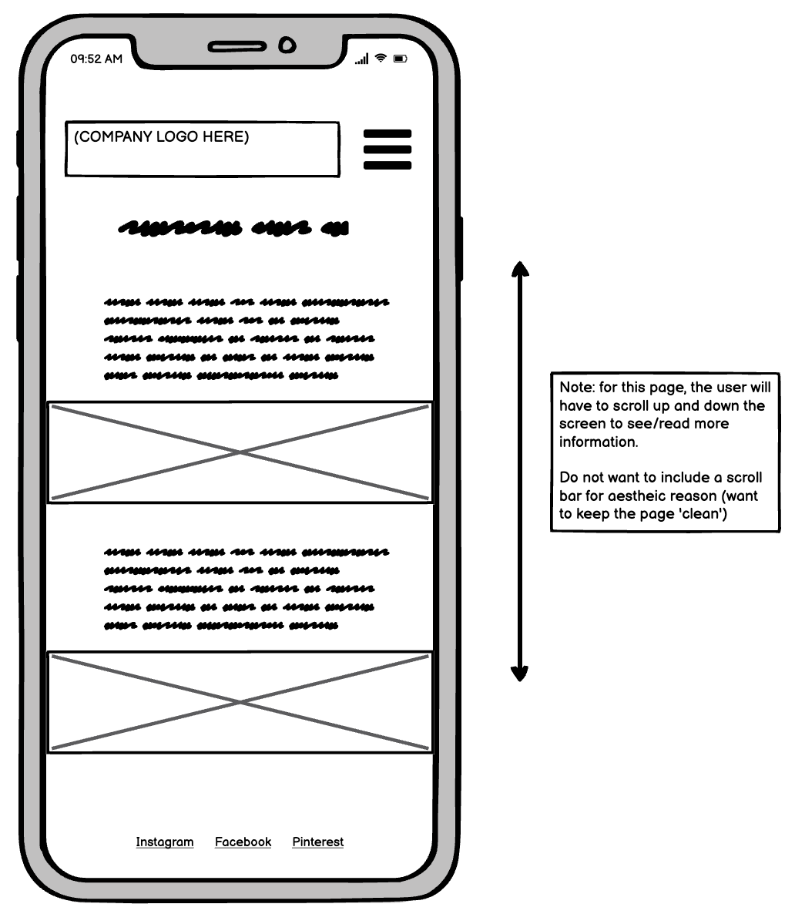
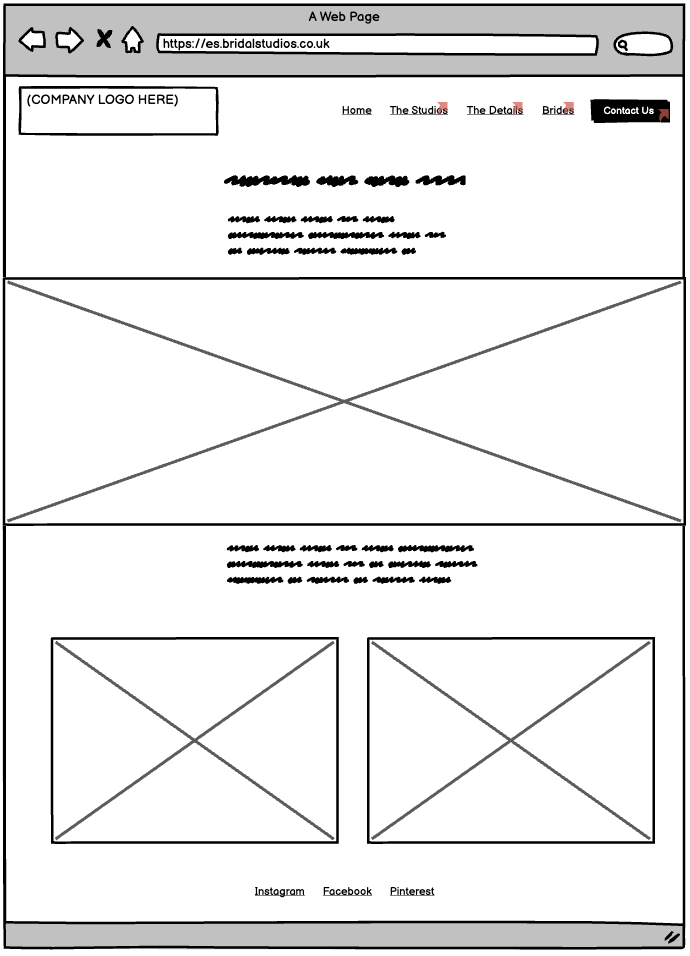
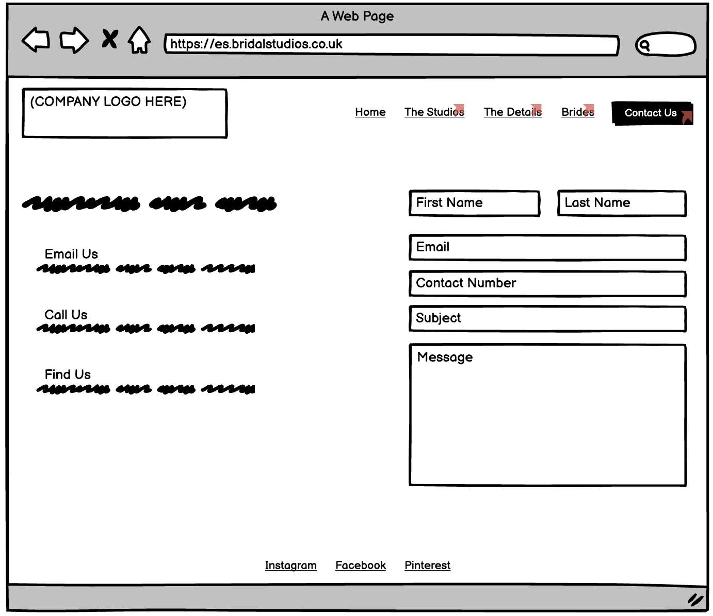
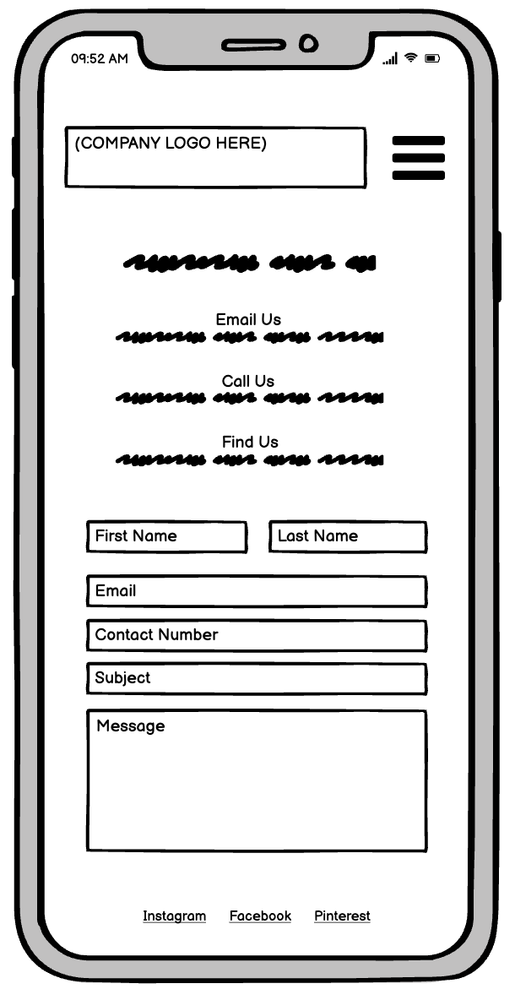

# Intro 

## Wireframes for Deskptop and Mobile devices

### Home/Landing page 

Desktop:

Mobile: The first screen shows what the site will look like when it appears on a mobile device for the 1st time. The second screen shows what the site will look like once the use clicks on the 'hamburger' menu icon.

### 'The Studios' page 

Desktop:

Mobile: 

### 'The Details' page 

Desktop: 

Mobile: the user will have to scroll up and down the screen to see/read more information.  Do not want to include a scroll bar for aestheic reason (want to keep the page 'clean')

### 'Brides' page 

Desktop: 

Mobile:

### 'Contact' page 

Desktop:

Mobile:

